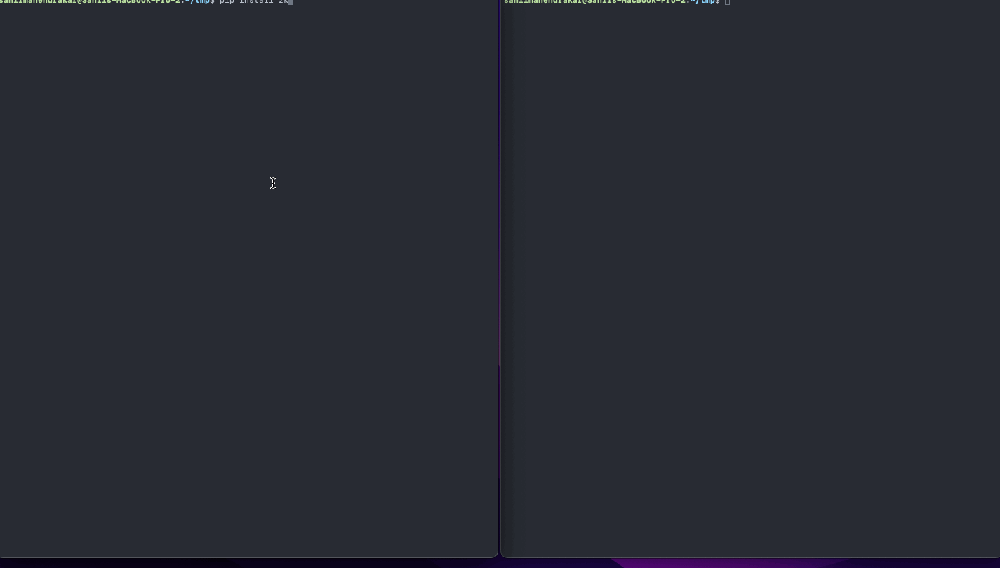
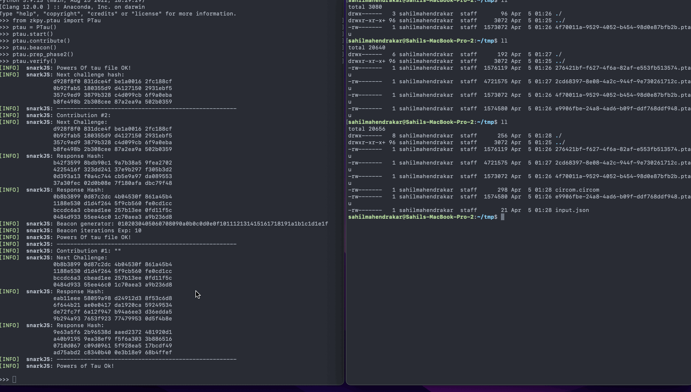

# zkpy
A Python library that allows for easy compiling/proving/verifying of zk circuits.

[](https://opensource.org/licenses/Apache-2.0)


[](https://pypi.org/project/zkpy/)
[](https://sahilmahendrakar.github.io/zkpy/)


## Overview
ZKPy is a Python library that allows for easy compiling/proving/verifying of zk circuits. It is implemented as a wrapper of Circom or SnarkJS, allowing developers to incorporate zero knowledge proofs into Python projects.

Features:
The `ptau` module allows users to:
- Create and contribute to a powers of tau ceremony
- Apply beacon to a powers of tau ceremony
- Perform phase 2 of a powers of tau ceremony (for groth16)
- Export and import contributions from 3rd party software
- Verify a powers of tau file

The `circuits` module allows users to:
- Compile circom circuits
- Generate r1cs, wasm, etc
- Generate witness from input file
- Prove circuits with support for three proving schemes (groth16, PLONK, FFLONK)
- Export verification keys
- Verify proofs with support for three proving schemes (groth16, PLONK, FFLONK)

## Dependencies
zkpy requires [Circom](https://docs.circom.io/getting-started/installation/) and [snarkjs](https://github.com/iden3/snarkjs). You can find installation instructions [here](https://docs.circom.io/getting-started/installation/).

## Installation
The recommended way to install zkpy is through pip.
```
pip install zkpy
```

## Usage
### Powers of Tau
Here is an example use case walking through a powers of tau ceremony:
```
from zkpy.ptau import PTau

ptau = PTau()
ptau.start() 
ptau.contribute()
ptau.beacon()
ptau.prep_phase2()
```

The `PTau` object maintains an underlying powers of tau file throughout these operations. You can also import an existing ptau file:
```
ptau = PTau(ptau_file="ptau_file.ptau")
```

At any stage, we can verify the powers of tau file is valid:
```
ptau.verify()
```


### Circuit
This class uses a circuit defined in a circom file to generate and verify zk proofs.

Here is an example scenario walking through compiling a circuit, generating witnesses, generating a proof, and verifying the proof:
```
from zkpy.circuit import Circuit, GROTH, PLONK, FFLONK

circuit = Circuit("./circuit.circom")
circuit.compile()
circuit.get_info()
circuit.print_constraints()
circuit.gen_witness("./example_circuits/input.json")
circuit.setup(PLONK, ptau)
circuit.prove(PLONK)
circuit.export_vkey()
circuit.verify(PLONK, vkey_file="vkey.json", public_file="public.json", proof_file="proof.json")
```


## Contributing
Help is always appreciated! Feel free to open an issue if you find a problem, or open a pull request if you've solved an issue.

See more at [CONTRIBUTING.md](./CONTRIBUTING.md)